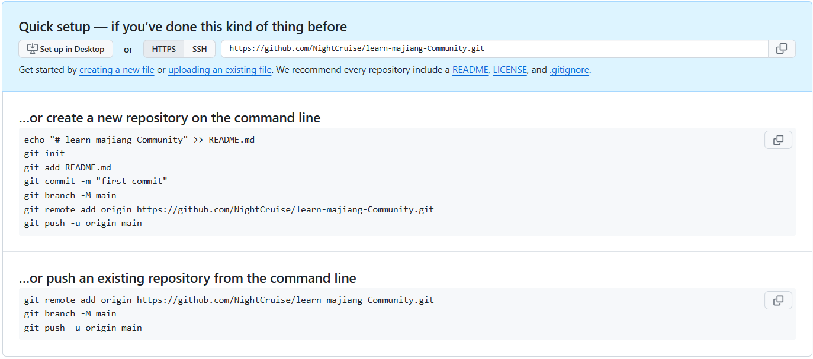
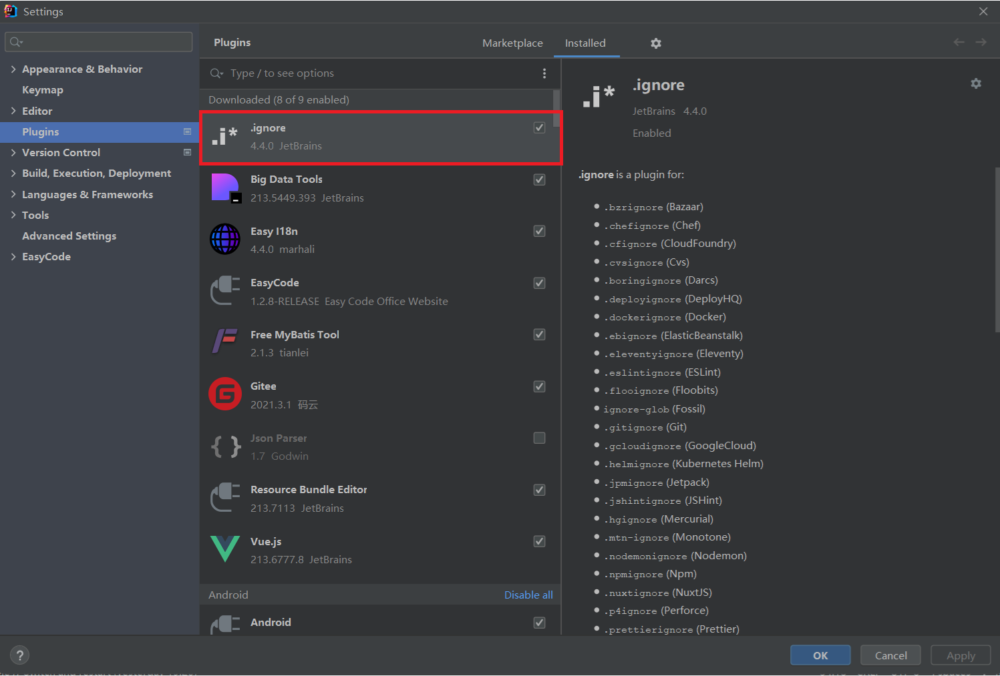
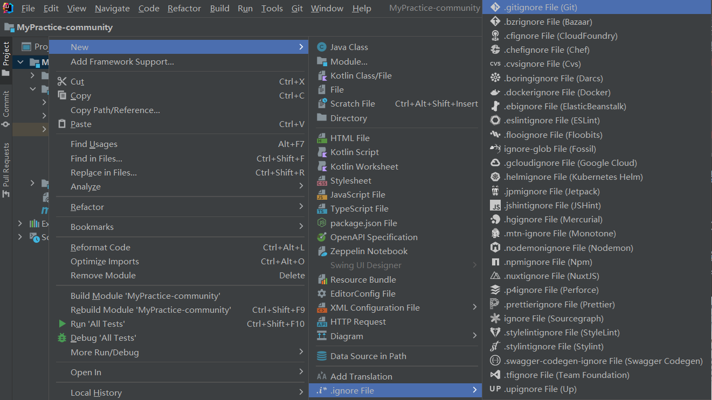

# 学习码匠社区

## p1-p4
### 创建 Spring Boot 项目
导包：
~~~maven
<!-- spring boot starters -->
<dependency>
    <groupId>org.springframework.boot</groupId>
    <artifactId>spring-boot-starter-web</artifactId>
</dependency>
<!-- test -->
<dependency>
    <groupId>org.springframework.boot</groupId>
    <artifactId>spring-boot-starter-test</artifactId>
    <scope>test</scope>
</dependency>
<!-- Thymeleaf -->
<dependency>
    <groupId>org.springframework.boot</groupId>
    <artifactId>spring-boot-starter-thymeleaf</artifactId>
</dependency>
~~~
按照教程https://spring.io/guides/gs/serving-web-content 写出 Spring Boot 项目入门的案例

创建Github repository：

我创建的仓库名字是 **learn-majiang-Community**，创建完成后会出现一个Quick setup：

初始化Git仓库：在IDEA相应文件夹点击 open in terminal，输入`git init`

生成.gitignore文件插件：

添加所有文件的更改：在 terminal 输入 `git add .`

按照之前图片里提出的Quick Setup设置一下远程仓库，然后创建README.md，然后push上去。

# 问题解决命令
问题描述：
HTTP/2 stream 1 was not closed cleanly before end of the underlying stream
~~~bash
git config --global http.version HTTP/1.1
~~~

#快捷键学习
`ctrl + F6`: 修改方法参数

`ctrl + R`: 在IDEA的Terminal快速查找历史指令

`ctrl + shift + F12`: 全屏

`alt + 拖动鼠标`: 选择多行

`alt + J`: 单次选择相同勾选的部分

`ctrl + E`: 浏览最近使用的文件

`ctrl + alt + O`: 清楚无效的引用
